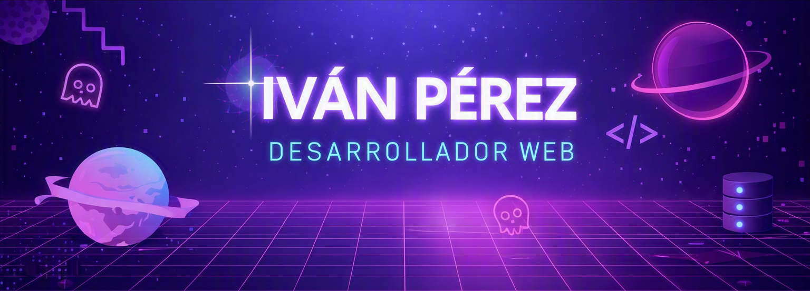
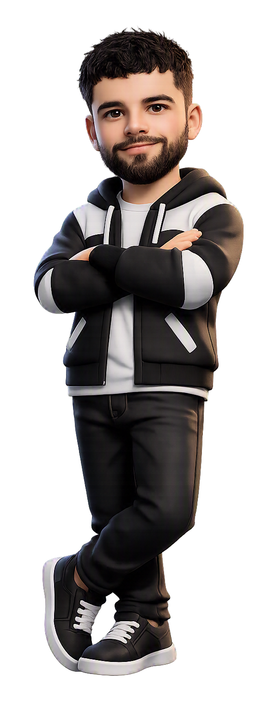

<!-- Banner principal -->

  <!-- Aquí va tu banner futurista -->
  

---

<h2 align="center">About Me</h2>
<table align="center">
  <tr>
    <td>
      <ul>
        <li>Estudiante de desarrollo web.</li>
        <li>Me gusta crear interfaces modernas y layouts responsive.</li>
        <li>Frontend: HTML, CSS, JavaScript.</li>
        <li>Backend: Java, Spring Boot.</li>
        <li>Interesado en UI/UX y buenas prácticas de código.</li>
        <li>Buscando colaborar en proyectos con HTML, CSS y JavaScript.</li>
        <li>Cómo contactarme: <b>tuemail@ejemplo.com</b></li>
      </ul>
    </td>
    <td>
      <!-- Aquí va tu avatar generado -->
      
    </td>
  </tr>
</table>

---

<h2 align="center">Technologies & Tools</h2>

  

---

<h2 align="center">Stats</h2>

  

<!--
**Ivan16575/Ivan16575** is a ✨ _special_ ✨ repository because its `README.md` (this file) appears on your GitHub profile.

Here are some ideas to get you started:

- 🔭 I’m currently working on ...
- 🌱 I’m currently learning ...
- 👯 I’m looking to collaborate on ...
- 🤔 I’m looking for help with ...
- 💬 Ask me about ...
- 📫 How to reach me: ...
- 😄 Pronouns: ...
- ⚡ Fun fact: ...
-->
